 

 

## ✦ About Me

> Cybersecurity undergraduate at **SLIIT** with a strong curiosity for everything IT, from networks and cloud to software and design. I enjoy turning small ideas into working projects, and I'm always mapping out the next skill to learn.

 

## ✦ Tech Constellation

<h4 align="center">Languages</h4>

<h4 align="center">Web & Frameworks</h4>

<h4 align="center">Cloud, Servers & DevOps</h4>

<h4 align="center">Databases</h4>

<h4 align="center">Networking, Security & Hardware</h4>

<h4 align="center">Data, Graphics & Design</h4>

 

## ✦ GitHub Stats

 

 

### ✦ Top Contributed Repos

 

<!-- Proudly created with GPRM ( https://gprm.itsvg.in ) -->
